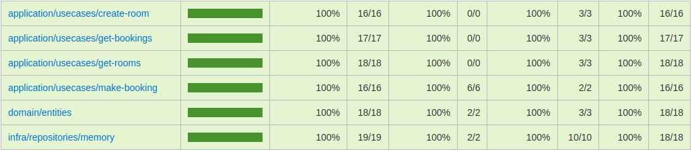

# booking-app
## Implementando conceitos de Clean Architecture, SOLID e TDD

Temos um senário simples onde, devemos criar uma aplicação responsável por criar quartos e atribuir a eles novas reservas.

Temos 2 entidades (Room e Booking)

Identificamos os usecases (Get rooms, createRoom, getBookings, makeBooking)

O senário é apenas de exemplo, em um grande sistema a complexidade é maior, teremos mais entidades, usecases, eventos, serviços de e-mail, gateway de pagamento, entre outros.

## TDD

No teste, utilizamos a biblioteca Jest, conseguimos abrangir 2 tipos de testes contidos dentro do TDD (unit e integration)



## Scripts SQLServer

```
CREATE DATABASE Booking_App

CREATE TABLE Rooms (
    Id VARCHAR(36) PRIMARY KEY,
    Capacity INT NOT NULL,
    Price FLOAT NOT NULL,
    Description VARCHAR(60) NOT NULL,
    IsAvailable TINYINT NOT NULL,
    Created DATETIME DEFAULT CURRENT_TIMESTAMP,
    Updated DATETIME DEFAULT CURRENT_TIMESTAMP
)

CREATE TABLE Bookings (
    Id VARCHAR(36) PRIMARY KEY,
    RoomId VARCHAR(36) NOT NULL,
    FOREIGN KEY (RoomId)
    REFERENCES Rooms(Id),
    CheckIn DATETIME NOT NULL,
    CheckOut DATETIME NOT NULL,
    Created DATETIME DEFAULT CURRENT_TIMESTAMP,
    Updated DATETIME DEFAULT CURRENT_TIMESTAMP
)
```

## Ambiente de desenvolvimento

Devemos criar um arquivo .env dentro da basta root do projeto, logo após, inserimos as configurações de acesso ao banco de dados.
```
DB_HOST=yourhost
DB_USER=youruser
DB_PASS=yourpassword
DB_NAME=yourdatabase
```
